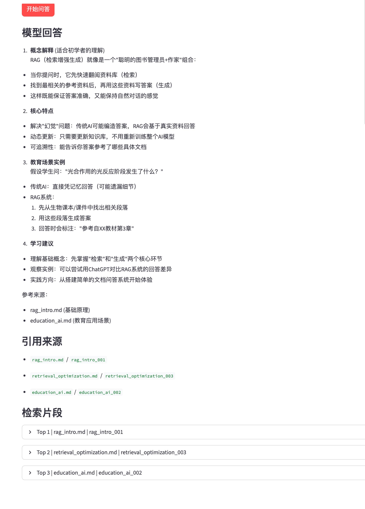
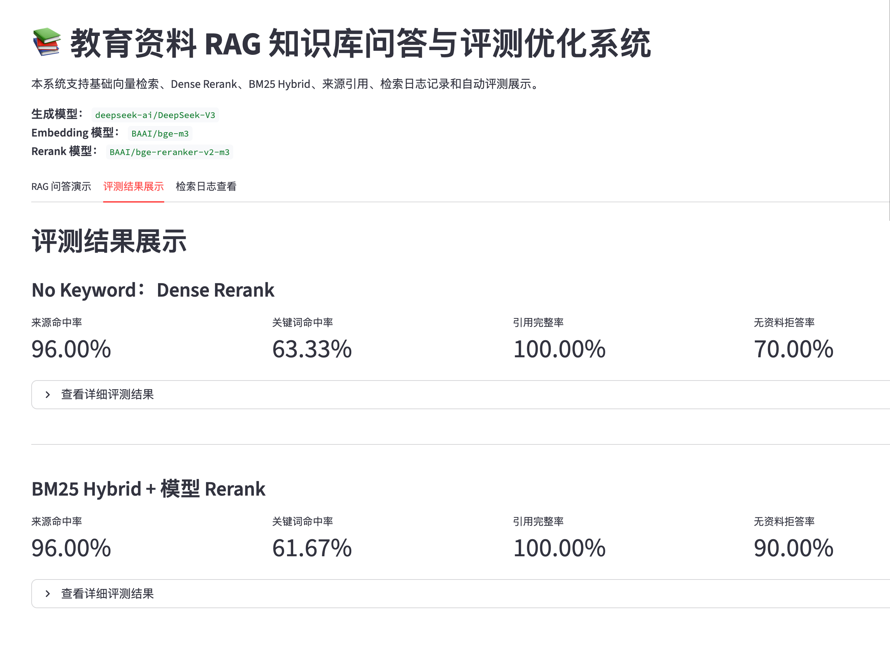

# 教育资料 RAG 知识库问答与评测优化系统

## 一、项目背景

本项目是一个面向教育资料的大模型 RAG 知识库问答与评测优化系统，基于 Python、FastAPI、ChromaDB 和 Streamlit 构建。

系统支持本地教育资料读取、文本切分、Embedding 向量化、向量检索、关键词检索、Hybrid Search、Rerank 重排序、大模型回答生成、来源引用、日志记录、自动评测和可视化展示。

项目目标不是单纯实现一个问答 Demo，而是构建一个具备检索优化、结果溯源、效果评测和失败样例分析能力的 RAG 工程项目。

---

## 二、技术栈

* Python
* FastAPI
* Streamlit
* ChromaDB
* sentence-transformers
* SiliconFlow / DeepSeek API
* Prompt Engineering
* JSON / JSONL / CSV
* Hybrid Search
* Rerank
* RAG Evaluation

---

## 三、系统功能

### 1. 基础 RAG 问答

系统支持读取本地教育资料文档，将文档切分为多个 chunk，并使用 Embedding 模型将文本片段转换为向量后写入 ChromaDB。

用户输入问题后，系统会检索相关知识片段，构造 RAG Prompt，并调用大模型生成回答。

### 2. 来源引用返回

系统会返回回答所依据的来源文档和 chunk_id，便于追溯答案依据，提高问答结果的可信度。

### 3. Hybrid Search 检索优化

系统在基础向量检索基础上新增关键词检索能力，将向量检索结果和关键词检索结果进行融合，形成 Hybrid Search 候选召回结果。

### 4. Dense-Preserving Hybrid Search + Rerank

在实验过程中发现，直接使用 Hybrid Search 替代基础向量检索时，简单关键词匹配可能引入噪声。

因此系统采用 Dense-Preserving Hybrid Search + Rerank 策略：

```text
基础向量检索兜底
↓
Hybrid Search 扩大候选召回
↓
轻量级 Rerank 重排序
↓
保留 dense top2
↓
使用 rerank 后的 hybrid 结果补充最终上下文
```

该策略既保留了向量检索的语义稳定性，也利用 Hybrid Search 和 Rerank 提升候选片段的覆盖度和排序效果。

### 5. 自动评测

系统构建了 50 条 RAG 测试问题，覆盖概念解释、原理机制、对比辨析、教育应用和资料缺失等类型。

评测指标包括：

* 来源命中率
* 关键词命中率
* 引用完整率
* 无资料拒答率
* 平均回答长度
* 平均检索片段数

### 6. 日志记录与失败样例分析

系统会记录 RAG 问答日志和检索日志，包括检索模式、候选片段、最终上下文、来源引用和回答长度等信息。

同时，项目提供失败样例分析脚本，用于定位检索失败、回答覆盖不足、Prompt 约束不足、知识库缺失等问题。

### 7. Streamlit 可视化展示

项目提供 Streamlit 页面，支持：

* 输入问题
* 选择检索模式：vector / hybrid
* 设置 top_k
* 设置 candidate_k
* 启用或关闭 Rerank
* 展示模型回答
* 展示引用来源
* 展示检索片段
* 展示 dense_score、sparse_score、hybrid_score、rerank_score
* 展示评测结果
* 查看检索日志

---

## 四、项目结构

```text
edu-rag-assistant/
├── app.py
├── web_demo.py
├── llm_client.py
├── config.py
├── prompt_templates.py
├── document_loader.py
├── text_splitter.py
├── embedding_client.py
├── vector_store.py
├── hybrid_retriever.py
├── reranker.py
├── rag_pipeline.py
├── rag_logger.py
├── rag_evaluator.py
├── experiment_runner.py
├── log_analyzer.py
├── DEV_SPEC.md
├── data/
│   ├── raw_docs/
│   ├── chunks/
│   └── rag_test_questions.json
├── vector_db/
├── logs/
│   ├── rag_log.json
│   └── retrieval_log.json
├── eval_results/
│   ├── baseline_eval.csv
│   ├── hybrid_rerank_eval.csv
│   ├── experiment_summary.json
│   ├── experiment_report.md
│   └── failure_cases.md
├── assets/
│   └── rag_demo.png
├── requirements.txt
├── .env.example
└── README.md
```

---

## 五、核心流程

```text
文档读取
↓
文本切分
↓
Embedding 向量化
↓
向量库构建
↓
向量检索 / 关键词检索
↓
Hybrid Search
↓
Rerank 重排序
↓
Prompt 构造
↓
大模型生成回答
↓
来源引用
↓
日志记录
↓
自动评测
↓
Dashboard 展示
```

---

## 六、模型说明

本项目使用两类模型：

### 1. Embedding 模型

```text
sentence-transformers/paraphrase-multilingual-MiniLM-L12-v2
```

用于将教育资料文本和用户问题转换为向量，并基于 ChromaDB 进行相似度检索。

### 2. 生成式大模型

项目通过 SiliconFlow API 接入 DeepSeek 模型，用于根据检索到的上下文生成最终回答。

项目支持 Mock 模式：

```text
USE_MOCK=true
```

也支持真实 API 模式：

```text
USE_MOCK=false
```

---

## 七、评测设计

测试集文件：

```text
data/rag_test_questions.json
```

测试集共 50 条问题，覆盖以下类型：

| 问题类型        | 说明    |
| ----------- | ----- |
| concept     | 概念解释类 |
| mechanism   | 原理机制类 |
| compare     | 对比辨析类 |
| application | 教育应用类 |
| missing     | 资料缺失类 |

每条测试样例包含：

```json
{
  "id": 1,
  "question": "什么是 RAG？",
  "expected_source": "rag_intro.md",
  "expected_keywords": ["检索", "生成", "知识库"],
  "question_type": "concept"
}
```

---

## 八、实验结果

本项目对基础向量检索方案和 Dense-Preserving Hybrid Search + Rerank 方案进行了对比实验。

| 实验方案                                    |  来源命中率 | 关键词命中率 |   引用完整率 |  无资料拒答率 | 平均回答长度 | 平均检索片段数 |
| --------------------------------------- | -----: | -----: | ------: | ------: | -----: | ------: |
| Baseline：基础向量检索                         | 97.50% | 46.00% | 100.00% |  80.00% |  560.8 |     3.0 |
| Dense-Preserving Hybrid Search + Rerank | 97.50% | 54.00% | 100.00% | 100.00% |  544.3 |     3.0 |

实验结果表明，优化后的 Dense-Preserving Hybrid Search + Rerank 在保持来源命中率不下降的情况下，将关键词命中率从 46.00% 提升到 54.00%，并将无资料拒答率从 80.00% 提升到 100.00%。

这说明该策略在保留基础向量检索稳定性的同时，能够提升回答覆盖度，并增强资料缺失场景下的幻觉控制能力。

详细实验报告见：

```text
eval_results/experiment_report.md
```

失败样例分析见：

```text
eval_results/failure_cases.md
```

---

## 九、运行方式

### 1. 安装依赖

```bash
pip install -r requirements.txt
```

### 2. 配置环境变量

复制 `.env.example`：

```bash
cp .env.example .env
```

示例配置：

```text
USE_MOCK=true
MODEL=deepseek-ai/DeepSeek-V3
API_KEY=your_api_key_here
BASE_URL=https://api.siliconflow.cn/v1/chat/completions
```

### 3. 构建 chunks

```bash
python text_splitter.py
```

### 4. 构建向量库

```bash
python vector_store.py
```

### 5. 启动 FastAPI

```bash
uvicorn app:app --reload
```

访问接口文档：

```text
http://127.0.0.1:8000/docs
```

### 6. 调用 RAG 接口

```json
{
  "question": "什么是 RAG？",
  "top_k": 3,
  "retriever_mode": "hybrid",
  "candidate_k": 10,
  "use_rerank": true
}
```

### 7. 启动 Streamlit 页面

```bash
streamlit run web_demo.py
```

---

## 十、自动评测

运行对比实验：

```bash
python experiment_runner.py
```

输出文件：

```text
eval_results/baseline_eval.csv
eval_results/hybrid_rerank_eval.csv
eval_results/experiment_summary.json
```

生成失败样例分析：

```bash
python log_analyzer.py
```

输出文件：

```text
eval_results/failure_cases.md
```

---

## 十一、页面展示

Streamlit 页面支持展示问答结果、引用来源、检索片段、检索分数、评测结果和检索日志。

示例截图：
### RAG 问答与检索片段展示



### 自动评测结果展示



---

## 十二、后续优化方向

1. 使用 BM25 替代当前简单关键词匹配，提高 sparse search 的检索质量；
2. 使用 Cross-Encoder Rerank 模型替代规则打分，提高候选片段排序效果；
3. 增加 Query Rewrite，提高复杂问题和模糊问题的检索效果；
4. 扩充教育资料知识库，引入更多课程资料、论文笔记和教学案例；
5. 接入 Ragas 等更完整的 RAG 评测框架，补充上下文相关性、忠实度等指标；
6. 后续扩展 Agent 或 MCP Server，增强复杂任务处理能力。

---

## 十三、项目亮点

1. 实现了教育资料 RAG 问答完整链路；
2. 支持基础向量检索和 Hybrid Search 两种检索模式；
3. 设计了 Dense-Preserving Hybrid Search + Rerank 策略；
4. 支持答案来源引用和检索日志记录；
5. 构建 50 条测试问题集并完成自动评测；
6. 输出实验报告和失败样例分析；
7. 使用 Streamlit 搭建可视化演示页面；
8. 项目具备可展示、可评测、可复盘和可写入简历的完整工程闭环。
