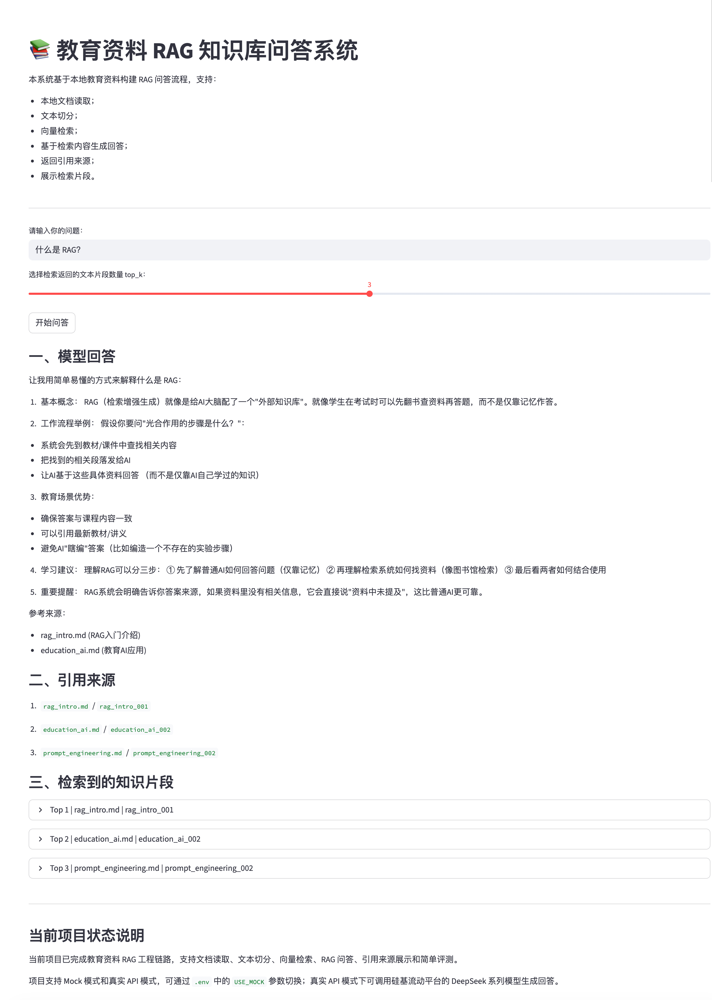

# 教育资料 RAG 知识库问答系统

## 一、项目简介

本项目是一个面向教育资料问答场景的 RAG 知识库问答系统，基于 Python、FastAPI、ChromaDB、sentence-transformers 和 Streamlit 构建。

系统支持本地 Markdown 文档读取、文本切分、Embedding 向量化、向量数据库存储、Top-K 相似度检索、基于检索内容生成回答、返回引用来源、记录 RAG 问答日志，并提供简单的 RAG 效果评测与可视化演示页面。

项目支持 Mock 模式和真实 API 模式。通过 `.env` 文件中的 `USE_MOCK` 参数可以切换运行方式：`USE_MOCK=true` 时使用模拟回答，`USE_MOCK=false` 时调用硅基流动平台的 DeepSeek 系列模型。

---
## 二、项目演示

Streamlit 演示页面支持用户输入问题、设置 `top_k`、查看模型回答、引用来源和检索到的知识片段。



## 三、项目背景

大模型在教育问答、学习辅导、论文辅助阅读和教学资源检索等场景中具有较强应用价值，但普通大模型问答存在回答缺少资料依据、容易产生幻觉、难以追溯来源等问题。

本项目围绕大模型应用开发、RAG 应用开发和大模型评测等方向展开，从基础问答接口出发，逐步实现 Prompt 模板管理、多模式问答、日志记录、关键词评测、文档处理、向量检索、RAG 问答和可视化演示，重点训练以下能力：

1. Python 项目结构组织；
2. FastAPI 后端接口开发；
3. Prompt 模板设计；
4. 本地文档读取与文本切分；
5. Embedding 向量化与 ChromaDB 向量检索；
6. RAG Prompt 构造与问答流程封装；
7. 引用来源返回与检索片段追溯；
8. RAG 日志记录与简单效果评测；
9. Streamlit 可视化演示页面构建；
10. Mock 模式与真实大模型 API 模式切换。

---

## 四、技术栈

* Python
* FastAPI
* Uvicorn
* Pydantic
* python-dotenv
* requests
* JSON
* pathlib
* sentence-transformers
* ChromaDB
* Streamlit
* Prompt Engineering
* RAG
* 硅基流动 DeepSeek API
* Mock 模拟模式
* 简单关键词评测

---

## 五、当前功能

1. 支持命令行问答；
2. 支持 FastAPI 后端接口；
3. 支持基础问答接口 `POST /chat`；
4. 支持 RAG 问答接口 `POST /rag_chat`；
5. 支持 GET `/health` 健康检查接口；
6. 支持 GET `/modes` 查看所有问答模式；
7. 支持 Prompt 模板管理；
8. 支持 `general`、`education`、`paper_summary` 等问答模式；
9. 支持本地 Markdown 文档读取；
10. 支持将长文档切分为多个文本块；
11. 支持为每个文本块生成 `chunk_id`、`source` 和 `content`；
12. 支持使用 sentence-transformers 生成文本向量；
13. 支持使用 ChromaDB 构建本地向量数据库；
14. 支持根据用户问题进行 Top-K 相似文本检索；
15. 支持构造 RAG Prompt，将用户问题和检索内容拼接后生成回答；
16. 支持返回模型回答、引用来源和检索片段；
17. 支持记录普通问答日志和 RAG 问答日志；
18. 支持构建普通问答测试集和 RAG 测试集；
19. 支持来源命中率和关键词命中率评测；
20. 支持 Streamlit 网页演示页面；
21. 支持 Mock 模式和真实 API 模式切换；
22. 支持通过硅基流动平台调用 DeepSeek 系列模型。

---

## 六、项目结构

```text
llm-qa-eval-demo/
├── app.py                      # FastAPI 接口入口
├── main.py                     # 命令行问答入口
├── config.py                   # 项目配置管理
├── llm_client.py               # 模型调用入口，支持 Mock 和真实 API
├── chat_logger.py              # 普通问答日志保存
├── prompt_templates.py         # Prompt 模板管理
├── evaluator.py                # 普通问答关键词评测
├── document_loader.py          # 本地文档读取
├── text_splitter.py            # 文本切分
├── embedding_client.py         # 文本向量化
├── vector_store.py             # ChromaDB 向量库构建与检索
├── rag_pipeline.py             # RAG 问答主流程
├── rag_logger.py               # RAG 问答日志保存
├── rag_evaluator.py            # RAG 效果评测
├── web_demo.py                 # Streamlit 演示页面
├── data/
│   ├── raw_docs/               # 原始知识库文档
│   │   ├── rag_intro.md
│   │   ├── agent_intro.md
│   │   ├── prompt_engineering.md
│   │   └── education_ai.md
│   ├── chunks/
│   │   └── chunks.json         # 文本切分结果
│   ├── test_questions.json     # 普通问答测试集
│   └── rag_test_questions.json # RAG 测试集
├── logs/                       # 本地日志，已加入 .gitignore
├── results/                    # 本地评测结果，已加入 .gitignore
├── vector_db/                  # 本地向量数据库，已加入 .gitignore
├── assets/                     # 项目截图
├── .env.example                # 环境变量示例文件
├── .env                        # 环境变量文件，已加入 .gitignore
├── .gitignore
├── README.md
└── requirements.txt
```

---

## 七、RAG 流程

本项目的 RAG 问答流程如下：

```text
本地教育资料
↓
document_loader.py 读取文档
↓
text_splitter.py 文本切分
↓
生成 chunk_id、source、content
↓
embedding_client.py 生成文本向量
↓
vector_store.py 写入 ChromaDB
↓
用户输入问题
↓
向量检索 Top-K 相关文本块
↓
构造 RAG Prompt
↓
llm_client.py 调用 Mock 或真实大模型 API
↓
生成回答
↓
返回 answer、sources、retrieved_chunks
↓
记录 RAG 日志
↓
运行 RAG 评测
```

RAG 的核心思想是：在大模型生成答案之前，先从本地知识库中检索与用户问题相关的文本片段，再将检索内容和用户问题一起放入 Prompt 中，让模型基于资料生成回答。

相比普通问答系统，RAG 可以让回答更依赖指定资料，并返回引用来源，从而提高回答的可追溯性，减少模型幻觉。

---

## 八、环境变量配置

本项目支持 Mock 模式和真实 API 模式，可以通过 `.env` 文件中的 `USE_MOCK` 参数进行切换。

首次运行项目时，需要在项目根目录创建 `.env` 文件。可以参考 `.env.example`：

```bash
cp .env.example .env
```

### 1. Mock 模式

如果只想跑通项目流程，不调用真实大模型 API，可以使用 Mock 模式：

```env
USE_MOCK=true
DEEPSEEK_API_KEY=your_siliconflow_api_key_here
DEEPSEEK_BASE_URL=https://api.siliconflow.cn/v1/chat/completions
DEEPSEEK_MODEL=deepseek-ai/DeepSeek-V3
```

在 Mock 模式下，系统不会真实请求大模型 API，而是返回模拟回答，适合用于本地流程调试、接口测试和项目演示。

### 2. 真实 API 模式

如果需要调用硅基流动平台上的 DeepSeek 模型，需要将 `.env` 修改为：

```env
USE_MOCK=false
DEEPSEEK_API_KEY=你的硅基流动API_KEY
DEEPSEEK_BASE_URL=https://api.siliconflow.cn/v1/chat/completions
DEEPSEEK_MODEL=deepseek-ai/DeepSeek-V3
```

其中：

* `DEEPSEEK_API_KEY`：硅基流动平台的 API Key；
* `DEEPSEEK_BASE_URL`：硅基流动 OpenAI 兼容接口地址；
* `DEEPSEEK_MODEL`：调用的模型名称，例如 `deepseek-ai/DeepSeek-V3`；
* `USE_MOCK`：控制是否使用模拟模式。

注意：`.env` 文件包含 API Key，已加入 `.gitignore`，不会上传 GitHub。

---

## 九、运行方式

### 1. 安装依赖

```bash
python -m pip install -r requirements.txt
```

### 2. 配置环境变量

复制环境变量示例文件：

```bash
cp .env.example .env
```

然后根据需要修改 `.env`。

如果使用 Mock 模式：

```env
USE_MOCK=true
```

如果使用真实 API 模式：

```env
USE_MOCK=false
DEEPSEEK_API_KEY=你的硅基流动API_KEY
DEEPSEEK_BASE_URL=https://api.siliconflow.cn/v1/chat/completions
DEEPSEEK_MODEL=deepseek-ai/DeepSeek-V3
```

### 3. 生成文本切分结果

```bash
python text_splitter.py
```

运行后会读取 `data/raw_docs/` 下的原始文档，并生成：

```text
data/chunks/chunks.json
```

### 4. 构建向量数据库

```bash
python vector_store.py
```

运行后会将文本块向量化，并写入本地 ChromaDB 向量数据库：

```text
vector_db/
```

`vector_db/` 是本地运行结果，已加入 `.gitignore`，不会上传 GitHub。

### 5. 测试大模型调用

```bash
python llm_client.py
```

如果 `USE_MOCK=true`，会返回模拟回答。

如果 `USE_MOCK=false` 且 API Key 配置正确，会调用硅基流动平台上的 DeepSeek 模型并返回真实回答。

### 6. 测试 RAG 主流程

```bash
python rag_pipeline.py
```

该命令会完成：

```text
用户问题
↓
向量检索相关文本片段
↓
构造 RAG Prompt
↓
调用 llm_client 生成回答
↓
返回引用来源和检索片段
```

### 7. 启动 FastAPI 接口

```bash
uvicorn app:app --reload
```

接口文档地址：

```text
http://127.0.0.1:8000/docs
```

核心接口：

```text
POST /rag_chat
```

### 8. 启动 Streamlit 演示页面

```bash
streamlit run web_demo.py
```

页面地址：

```text
http://127.0.0.1:8501
```

该页面支持：

* 输入用户问题；
* 设置 `top_k`；
* 展示模型回答；
* 展示引用来源；
* 展示检索到的文本片段。

### 9. 运行 RAG 评测

```bash
python rag_evaluator.py
```

评测结果会保存到：

```text
results/rag_eval_results.json
```

`results/` 是本地运行结果，已加入 `.gitignore`，不会上传 GitHub。

---

## 十、核心接口

### POST `/rag_chat`

请求示例：

```json
{
  "question": "什么是 RAG？",
  "top_k": 3
}
```

返回示例：

```json
{
  "question": "什么是 RAG？",
  "answer": "RAG 是检索增强生成，它会先从外部知识库中检索相关资料，再结合大模型生成回答。",
  "sources": [
    {
      "source": "rag_intro.md",
      "chunk_id": "rag_intro_001"
    }
  ],
  "retrieved_chunks": [
    {
      "chunk_id": "rag_intro_001",
      "source": "rag_intro.md",
      "content": "RAG 的全称是 Retrieval-Augmented Generation，中文通常叫检索增强生成……",
      "distance": 0.123
    }
  ]
}
```

---

## 十一、RAG 评测

项目构建了 `data/rag_test_questions.json` 作为 RAG 测试集，每条测试样例包含：

* `question`：测试问题；
* `expected_source`：预期检索命中的来源文档；
* `expected_keywords`：预期回答中应包含的关键词。

当前评测指标包括：

1. `source_hit`：检索结果是否包含预期来源文档；
2. `keyword_hit`：模型回答是否包含预期关键词。

运行方式：

```bash
python rag_evaluator.py
```

评测结果会保存到：

```text
results/rag_eval_results.json
```

该文件属于本地运行结果，不上传 GitHub。

---

## 十二、当前状态

当前项目已经完成教育资料 RAG 知识库问答系统的主要工程链路，包括：

```text
文档读取
文本切分
向量化
向量检索
RAG Prompt 构造
真实 API 调用
引用来源返回
日志记录
RAG 评测
Streamlit 演示页面
```

项目支持 Mock 模式和真实 API 模式，可通过 `.env` 文件中的 `USE_MOCK` 参数切换。

当前知识库使用的是本地示例 Markdown 文档，后续可以扩展为 PDF、Word、网页、数据库或课程资料库等更复杂的数据源。

---

## 十三、后续优化方向

后续可以继续优化以下方向：

1. 支持 PDF、Word 等更多文档格式；
2. 支持用户上传文档并自动构建知识库；
3. 优化 chunk_size 和 chunk_overlap 参数；
4. 增加 rerank 模块，提高检索结果质量；
5. 增加更细粒度的 RAG 评测指标；
6. 接入更多大模型服务商；
7. 增加前端交互体验和项目截图展示；
8. 支持多轮对话和历史上下文管理；
9. 扩展为教育资料智能问答助手或论文阅读助手。

```
```
